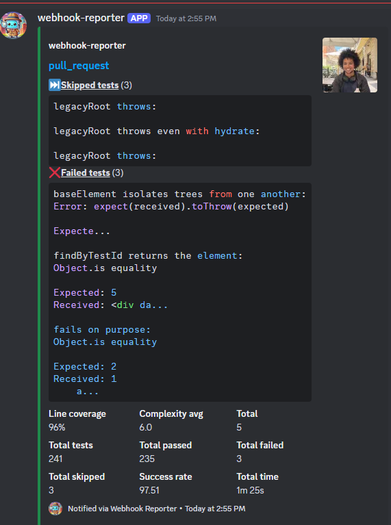
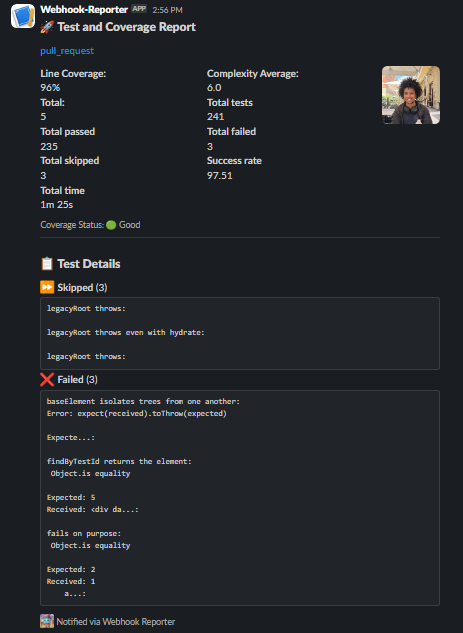
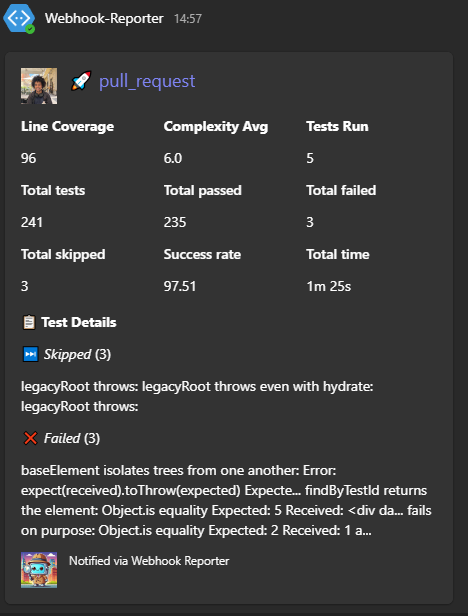

# Webhook Reporter
Seamlessly send test reports to your preferred messaging platforms.
## Description
Webhook Reporter is a versatile GitHub Action designed to generate and send detailed test coverage and test result reports to multiple messaging platforms. It seamlessly parses coverage and test result data, standardizes the reports, and delivers them through webhooks to platforms such as Discord, Slack, or Microsoft Teams.

### Why Webhook Reporter?
Modern development teams need real-time feedback from their CI/CD pipelines. Webhook Reporter bridges the gap between testing workflows and collaboration tools by:
- Standardizing diverse coverage and test result formats.
- Delivering concise, actionable summaries to Slack, Discord, or Microsoft Teams.
- Reducing debugging time with clear, comprehensive insights.

## Features
- Supports multiple platforms: Discord, Slack, Microsoft Teams
- Parses test results and coverage data: Compatible with JaCoCo, Cobertura, Clover, etc.
- Generates unified reports: Combines test results and coverage into a single output.
- Easy integration: Works with any GitHub Actions workflow.

### Examples

<table>
  <tr>
    <th>Discord</th>
    <th>Slack</th>
    <th>Teams</th>
  </tr>
  <tr>
    <td>
      
      <br/><em>Test and coverage summary delivered to Discord</em>
    </td>
    <td>
      
      <br/><em>Test and coverage summary delivered to Slack</em>
    </td>
    <td>
      
      <br/><em>Test and coverage summary delivered to Teams</em>
    </td>
  </tr>
</table>


## Configuration Details
### Usage
To use this action in your workflow add it like so:

```yaml
steps:
  - name: Webhook Reporter
    uses: your-username/webhook-reporter@main
    with:
      webhook_url: ${{ secrets.WEBHOOK_URL }}
      provider: 'discord'  # 'discord', 'slack', or 'teams'
      coverage_file: 'path/to/coverage.xml'
      test_results_file: 'path/to/test-results.xml'

# This action will parse the provided files and send a report to the specified webhook URL. Ensure the files are generated before this step.
# If any file is missing or an error occurs during processing, the action will log the issue for troubleshooting.
```
> **Note:** Ensure your webhook URL is stored securely as a GitHub Secret (e.g., `WEBHOOK_URL`).


### Parameter Arguements

| Input               | Description                                                      | Required | Default |
|---------------------|------------------------------------------------------------------|----------|---------|
| `webhook_url`       | Webhook URL for the target messaging platform                    | Yes      | N/A     |
| `provider`          | Messaging platform (`discord`, `slack`, `teams`)                 | Yes      | N/A     |
| `coverage_file`     | Path to the coverage report (e.g., `coverage.xml`)               | Yes      | N/A     |
| `test_results_file` | Path to the test results report (e.g., `test-results.xml`)       | No       | N/A     |
| `coverage_threshold`| The coverage threshold you want to mark against your tests       | No       | N/A     |


## Framework Setup & Compatibility

Webhook Reporter works with any testing framework that produces standard coverage and test result formats. For comprehensive insights into your project's health, we'll help you generate both coverage and test results files.

### Supported Report Formats

#### Coverage Reports
| Format | Description | Common Frameworks |
|--------|-------------|-------------------|
| Cobertura XML | Industry-standard coverage format | Pytest, Jest, .NET |
| JaCoCo XML | Java-ecosystem coverage format | Java frameworks using JaCoCo |
| Clover XML | Alternative coverage format | Jest, PHP frameworks |

#### Test Results
| Format | Description | Common Frameworks |
|--------|-------------|-------------------|
| JUnit XML | Universal test result format | Most testing frameworks |
| JSON | Modern test output format | Jest, modern JavaScript frameworks |

### Framework Configuration

<details>
  <summary>JavaScript (Jest)</summary>

  ### Installation
  First, install the necessary dependencies:
  ```bash
  npm install --save-dev jest-junit
  ```

  ### Configuration
  Add to your `package.json`:
  ```json
  "jest-junit": {
    "outputDirectory": "./test-results",
    "outputName": "test-results.xml"
  }
  ```

  ### Usage
  ```bash
  jest --coverage --coverageReporters=cobertura --testResultsProcessor=jest-junit
  ```

  This generates:
  - Coverage report: `coverage/cobertura-coverage.xml`
  - Test results: `test-results/test-results.xml`

  ### Alternative Coverage Format
  Jest can also output coverage in Clover format:
  ```bash
  jest --coverage --coverageReporters=clover
  ```

  > **Note:** You only need either Cobertura OR Clover format - pick the one that best suits your needs.
</details>

<details>
  <summary>Python (Pytest)</summary>

  ### Installation
  ```bash
  pip install pytest-cov pytest-junit
  ```

  ### Usage
  ```bash
  pytest --cov=your_package --cov-report=xml:coverage.xml --junitxml=test-results.xml
  ```

  This command:
  - Runs pytest with coverage enabled
  - Generates Cobertura-compatible coverage report (`coverage.xml`)
  - Outputs test results in JUnit format (`test-results.xml`)
  
  The command will handle both coverage generation and test results output in formats that Webhook Reporter can process.
</details>

<details>
  <summary>Java (JaCoCo)</summary>

  Configure your Maven build tool for JaCoCo as follows:

  ```xml
  <plugin>
      <groupId>org.jacoco</groupId>
      <artifactId>jacoco-maven-plugin</artifactId>
      <version>0.8.7</version>
      <executions>
          <execution>
              <goals>
                  <goal>prepare-agent</goal>
              </goals>
          </execution>
          <execution>
              <id>report</id>
              <phase>test</phase>
              <goals>
                  <goal>report</goal>
              </goals>
          </execution>
      </executions>
  </plugin>
  ```

  For test results, add the Surefire plugin:
  ```xml
  <plugin>
      <groupId>org.apache.maven.plugins</groupId>
      <artifactId>maven-surefire-plugin</artifactId>
      <version>3.0.0-M5</version>
      <configuration>
          <redirectTestOutputToFile>true</redirectTestOutputToFile>
      </configuration>
  </plugin>
  ```

  ### Usage
  ```bash
  mvn clean test
  ```

  This will generate:
  - Coverage report in JaCoCo's native XML format: `target/site/jacoco/jacoco.xml`
  - Test results in JUnit format: `target/surefire-reports/TEST-*.xml`
</details>

<details>
  <summary>.NET (Cobertura)</summary>

  ### Installation
  ```bash
  dotnet add package coverlet.collector
  ```

  ### Usage
  ```bash
  dotnet test /p:CollectCoverage=true /p:CoverletOutputFormat=cobertura
  ```

  This generates:
  - Coverage report in Cobertura format: `coverage.cobertura.xml`
  - Test results are typically generated in the Visual Studio Test Platform's TRX format
</details>

<details>
  <summary>Other Frameworks</summary>

  Your framework should output one of these formats:
  - Coverage: Cobertura XML, JaCoCo XML, or Clover XML
  - Test Results: JUnit XML or JSON

  Many frameworks can output to these formats through plugins or configuration. If your framework doesn't support these formats directly, consider:
  1. Looking for coverage/reporting plugins that support these formats
  2. Using a format converter tool
  3. Creating a custom reporter that outputs in one of the supported formats
</details>

## Contributing
see: [Contribution.md](https://github.com/Moeh-Jama/webhook-reporter/blob/main/Contributions.md)


## License
This project is licensed under the MIT License - see the [LICENSE](LICENSE) file for details.